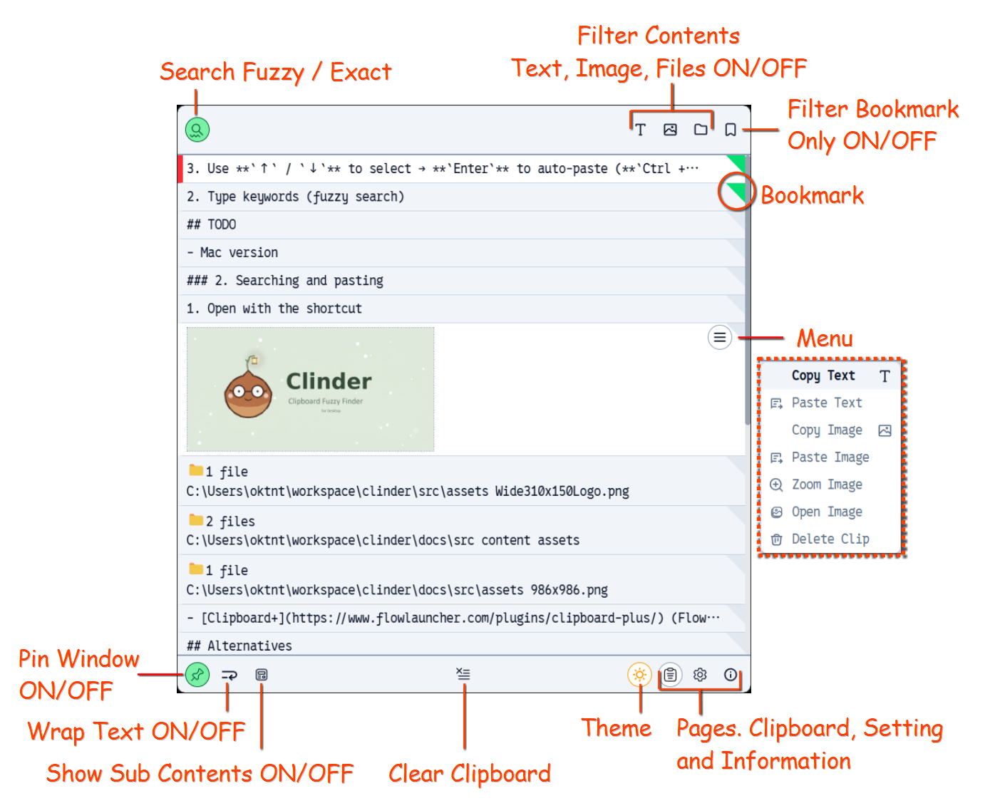

import { Image } from 'astro:assets';
import users_manual_clipboard from '../../../assets/users_manual_clipboard.png';
import { Aside, Icon } from '@astrojs/starlight/components';

You can search, copy, paste, and perform other operations on the clipboard.

## Features

### 🔍 Search Mode (Fuzzy / Exact)

Toggle between search behaviors depending on your needs:

- **Fuzzy (ON):** Matches query terms flexibly, even with minor typos or partial keywords (e.g., `cldr` matches `Clinder`).
- **Exact (OFF):** Matches the exact character sequence as typed.

### 🎛️ Content Filters

Filter your clipboard history by content type using the top-right icons:

- 📄 **Text** / 🖼️ **Image** / 📁 **File:** Toggle specific types ON or OFF to refine your search.
- **All OFF:** Displays all content types without filtering.

### ⭐️ Bookmark Filter

Filter your view to show only bookmarked clips:

- **Toggle Bookmark:** Click the green top-right corner tag on any item card, or press `Ctrl + B` (default shortcut).

### 📌 Pin Window

Keep Clinder visible even when it loses focus:

- **ON:** The window stays pinned on top of other applications when clicking outside.

### ↩️ Wrap Text

Toggle text wrapping for long entries:

- **ON:** Wraps text within the item card for easier reading without horizontal scrolling.

### 📑 Show Sub-Contents

Toggle supplementary data extracted from clips:

- **Primary vs. Sub-Content:** When copying rich data (e.g., from Excel), both text and image formats are captured. The secondary format is treated as sub-content.
- **OCR Text:** If OCR (Optical Character Recognition) is enabled, text extracted from images will also appear as sub-content.

### 🗑️ Clear Clipboard

- Permanently deletes all stored clipboard items. Bookmarked items will **not** be removed.

### ☀️ Theme Settings

- Seamlessly switch between **Light Mode** and **Dark Mode** to match your OS preferences.
